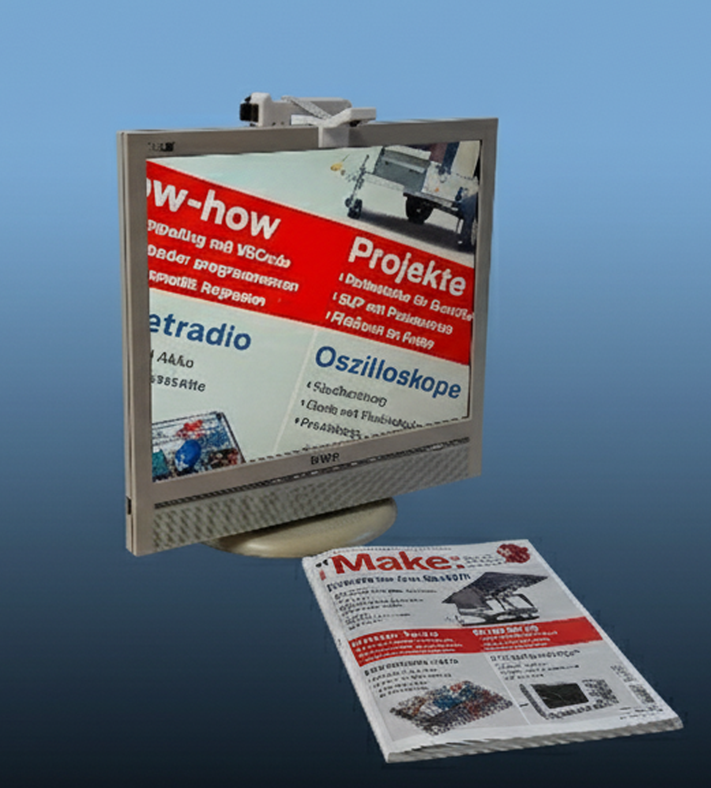

Maker Media GmbH

***

# Smarte Lesehilfe mit Raspberry Pi

**Mit einem Raspberry Pi und der Raspi-Kamera wird aus einem alten Monitor eine smarte
Lesehilfe. Diese kann dann nicht nur als digitale Lupe fungieren, sondern erkannte Texte
visuell aufbereiten und vorlesen.**

Hier gibt es !!! ein Template für die README.md in Github. Das Aufmacherbild sowie weitere Doku soll in den Ordner _doc_. Bitte für andere Dateien sinnvolle Ordner anlegen, etwa _src_ oder _cad_.
ISSUES UND WIKI DEAKTIVIEREN NICHT VERGESSEN.

Der vollständige Artikel zum Projekt steht in der **[Make-Ausgabe 2/26 ab Seite 52](https://www.heise.de/select/make/2026/2)**.
